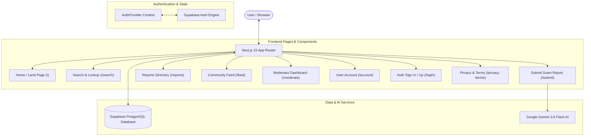

# ORlegit — System Architecture & Technical Report

**ORlegit** is a community-powered, AI-verified scam detection and community awareness platform built with **Next.js 15**, **Supabase (PostgreSQL & Auth)**, and **Google Gemini AI**.

---

## 🛠️ 1. Core Technology Stack

| Layer | Technology | Purpose / Details |
| :--- | :--- | :--- |
| **Frontend Framework** | **Next.js 15 (App Router)** | React 19, Server Components, Client Components, Suspense streaming |
| **Language** | **TypeScript** | Strict type safety across client & server models |
| **Backend & Database** | **Supabase (PostgreSQL)** | Relational database, Row Level Security (RLS) policies, triggers |
| **Authentication** | **Supabase Auth (`@supabase/ssr`)** | Real Email/Password auth, Google OAuth, RLS user session tokens |
| **AI Engine** | **Google Gemini AI (`@google/generative-ai`)** | Powered by `gemini-3.6-flash` model for real-time scam analysis |
| **Icons & Styling** | **Lucide React & CSS Variables** | Glassmorphism UI, custom CSS design system, responsive design |

---

## 🏗️ 2. System Architecture & Component Workflow




---

## ⚙️ 3. Detailed Feature Breakdown & Implementation Details

### 🔐 A. Real Authentication & Profile System
- **Provider**: Handled by [`src/components/AuthProvider.tsx`](file:///c:/Users/AARYAN/ORlegit/src/components/AuthProvider.tsx) and [`src/lib/supabase.ts`](file:///c:/Users/AARYAN/ORlegit/src/lib/supabase.ts).
- **Credentials Support**: Accepts both standard JWT keys (`ey...`) and Supabase's publishable keys (`sb_publishable_...`).
- **Profile Synchronization**: Upon user sign up or OAuth login, `AuthProvider` automatically checks for or provisions a record in the `public.profiles` database table, assigning an initial trust score (100) and defaulting usernames from email/metadata.
- **Security**: Row Level Security (RLS) policies ensure users can view public profiles but only modify their own account details.

---

### 🔍 B. Smart Search & Scam Lookup Engine
- **Location**: [`src/app/search/page.tsx`](file:///c:/Users/AARYAN/ORlegit/src/app/search/page.tsx)
- **Multi-Field Tokenization**: Search queries are parsed into tokens and evaluated across `title`, `target` (URL/domain/phone), `description`, `category`, and `username`.
- **Domain & Phone Normalization**: Automatically extracts clean hostnames (e.g. `https://www.scam-site.com/login` → `scam-site.com`) and strips formatting from phone numbers (`+91 98765 43210` → `9876543210`).
- **300ms Debouncing**: Input typing automatically triggers searches after 300ms without freezing the UI or sending out-of-order requests.
- **Category Filter Pills**: Interactive buttons for narrowing searches by scam category (*Phishing, Investment Fraud, Romance Scam, Fake Product, Tech Support, etc.*).
- **Smart Empty State**: When no matches exist, renders scam verification safety tips and a pre-filled *"Submit a report for this target"* button.

---

### 🤖 C. AI-Powered Scam Analysis
- **Location**: [`src/lib/gemini.ts`](file:///c:/Users/AARYAN/ORlegit/src/lib/gemini.ts) & [`src/app/api/analyze/route.ts`](file:///c:/Users/AARYAN/ORlegit/src/app/api/analyze/route.ts)
- **Prompt Engineering**: Reports submitted via [`/submit`](file:///c:/Users/AARYAN/ORlegit/src/app/submit/page.tsx) are evaluated against Gemini AI.
- **Output JSON Format**:
  ```json
  {
    "verdict": "LIKELY_SCAM" | "LIKELY_GENUINE" | "UNCERTAIN",
    "confidence": 85,
    "reasoning": "Target domain uses typosquatting of Chase Bank with high pressure language.",
    "red_flags": ["Domain registered 2 days ago", "Unsecured HTTP link", "Asks for OTP"]
  }
  ```

---

### 📊 D. Reports Directory & ScamScore Algorithm
- **Location**: [`src/app/reports/page.tsx`](file:///c:/Users/AARYAN/ORlegit/src/app/reports/page.tsx) & [`src/components/ReportCard.tsx`](file:///c:/Users/AARYAN/ORlegit/src/components/ReportCard.tsx)
- **Community Scoring**: Combines Gemini AI confidence with community upvotes (`community_scam_votes`) and downvotes (`community_genuine_votes`) to compute a weighted `ScamScore` (0-100%).
- **Sorting Options**: Allows sorting by *Newest First*, *Most Votes*, or *Highest Confidence*.

---

### 💬 E. Community Feed & Discussion Board
- **Location**: [`src/app/feed/page.tsx`](file:///c:/Users/AARYAN/ORlegit/src/app/feed/page.tsx) & [`src/app/feed/[id]/page.tsx`](file:///c:/Users/AARYAN/ORlegit/src/app/feed/[id]/page.tsx)
- **Post Sharing**: Enables community members to post scam warnings, personal experiences, questions, or news.
- **Evidence Uploads**: Includes image drag-and-drop support ([`src/components/DropZone.tsx`](file:///c:/Users/AARYAN/ORlegit/src/components/DropZone.tsx)).
- **Interactions**: Threaded post comments and like counts stored in `public.posts` and `public.post_comments`.

---

## 🗄️ 4. Database Schema Overview (Supabase PostgreSQL)

```sql
-- Profiles
create table public.profiles (
  id uuid references auth.users on delete cascade primary key,
  username text unique not null,
  avatar_url text,
  trust_score int default 100,
  created_at timestamptz default now()
);

-- Scam Reports
create table public.reports (
  id uuid default uuid_generate_v4() primary key,
  user_id uuid references public.profiles(id) on delete set null,
  title text not null,
  description text not null,
  target text not null,
  category report_category not null,
  evidence_urls text[] default '{}',
  ai_verdict verdict_type default 'UNCERTAIN',
  ai_confidence int default 50,
  ai_reasoning text default '',
  community_scam_votes int default 0,
  community_genuine_votes int default 0,
  status report_status default 'PENDING',
  created_at timestamptz default now(),
  updated_at timestamptz default now()
);

-- Feed Posts & Comments
create table public.posts (
  id uuid default uuid_generate_v4() primary key,
  user_id uuid references public.profiles(id) on delete cascade,
  title text not null,
  content text not null,
  category text not null,
  tags text[] default '{}',
  likes int default 0,
  created_at timestamptz default now()
);
```

---

## 🚀 5. How Everything Runs Locally

1. **Environment Variables** ([`.env.local`](file:///c:/Users/AARYAN/ORlegit/.env.local)):
   - `NEXT_PUBLIC_SUPABASE_URL`: Supabase project URL
   - `NEXT_PUBLIC_SUPABASE_ANON_KEY`: Supabase anon/publishable API key
   - `SUPABASE_SERVICE_ROLE_KEY`: Secret key used for database seeding scripts
   - `GEMINI_API_KEY`: API key for Google Gemini model
   - `NEXT_PUBLIC_USE_MOCK`: Set to `false` for real database and auth operation
2. **Development Server**: Runs via `npm run dev` on `http://localhost:3000`.
3. **Production Build**: Verified with `npm run build` with zero TypeScript or page generation errors.
